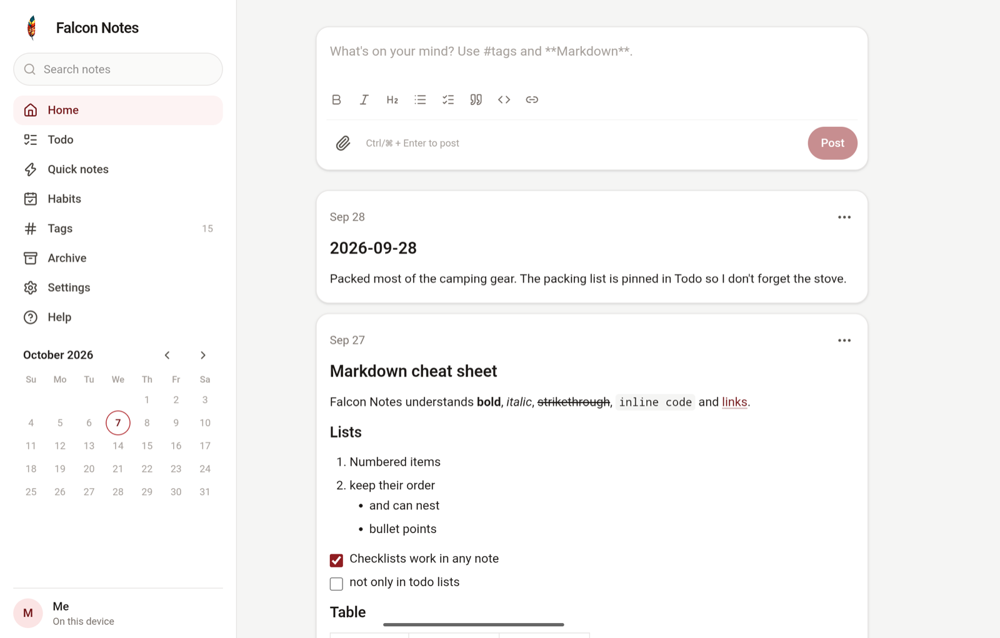
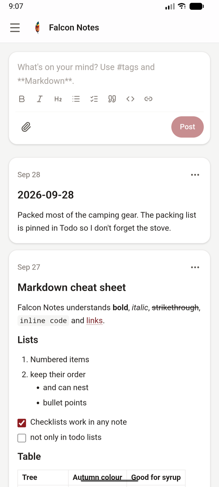
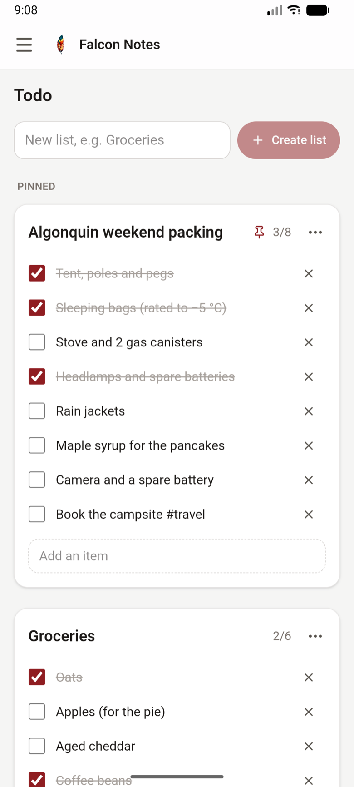
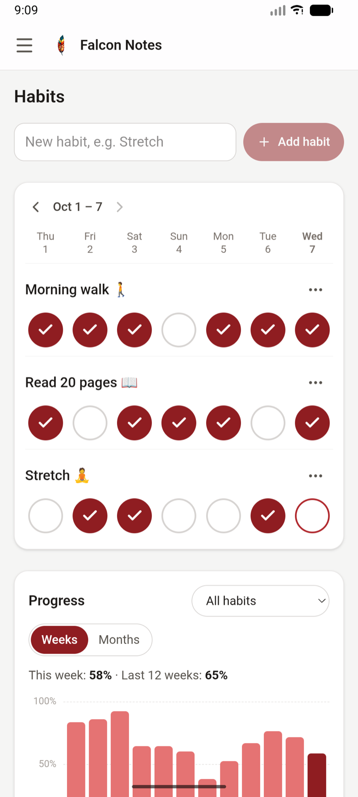
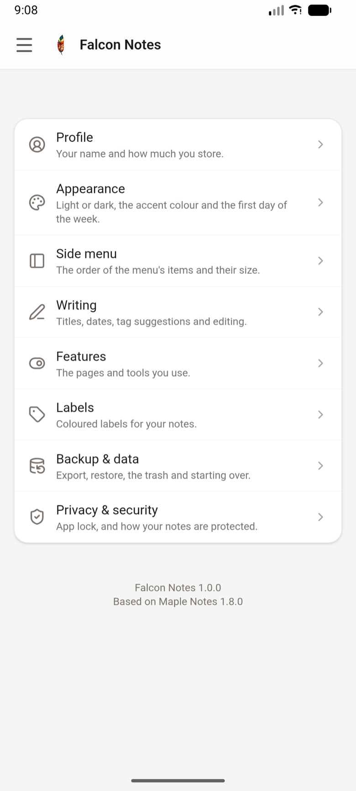
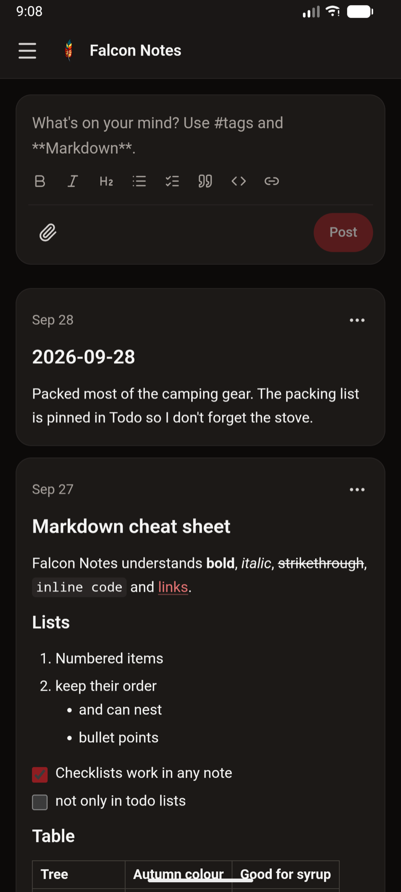
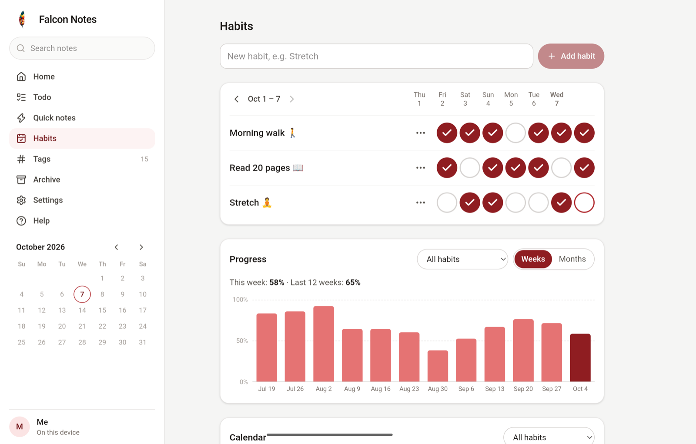

<p align="center">
  
</p>

<h1 align="center">Falcon Notes</h1>

<p align="center">
  Offline notes, todo lists and habits, encrypted on your device.<br>
  <b>No account · No server · No internet permission · No ads or tracking</b>
</p>

<p align="center">
  <a href="https://github.com/supunsarachitha/FalconNotes/actions/workflows/ci.yml"></a>
  
  
  <a href="LICENSE"></a>
</p>

<p align="center">
  <a href="https://supunsarachitha.github.io/FalconNotes/"><b>Website</b></a> ·
  <a href="https://supunsarachitha.github.io/FalconNotes/privacy.html"><b>Privacy policy</b></a> ·
  <a href="CHANGELOG.md"><b>Changelog</b></a> ·
  <a href="https://supunsarachitha.github.io/MapleNotes/"><b>Maple Notes web app</b></a>
</p>



## About

Falcon Notes is a note-taking app that works entirely on your device. There is no server and no sign-in: notes are
stored locally, always encrypted, and the Android app does not ask for internet access.

It is the offline companion of the [Maple Notes](https://supunsarachitha.github.io/MapleNotes/) web app, with the same
features and look under its own name and mark. Backups use the web app's export format, so notes move freely between
Falcon Notes, other devices and any Maple Notes server.

Falcon Notes is built with .NET 10 MAUI Blazor Hybrid. It currently runs on **Android 8.0 and later**, on phones and
tablets. Windows and macOS are planned ([12 Platforms](docs/12-platforms.md)).

## Contents

- [Screenshots](#screenshots)
- [Features](#features)
- [Privacy and security](#privacy-and-security)
- [Falcon Notes and Maple Notes](#falcon-notes-and-maple-notes)
- [Building from source](#building-from-source)
- [Documentation](#documentation)
- [Repository layout](#repository-layout)
- [Licence](#licence)

## Screenshots

| Home | Todo | Habits | Settings | Dark |
|:---:|:---:|:---:|:---:|:---:|
|  |  |  |  |  |



## Features

- **Timeline.** Newest notes first, a quick-post box at the top, and pinned notes above the feed.
- **Full note lifecycle.** Create, edit in place (optionally with a double-tap), pin, label, copy, archive and
  restore, and delete into a trash that keeps notes for 30 days, with Undo.
- **Markdown and tags.** GitHub-flavoured Markdown with task lists you tick in place, tables and code, a formatting
  toolbar, and `#tags`, including nested ones such as `#work/meetings`. A Tags page lists them all with counts.
- **Titles and dates.** Optionally give notes a title, which can start with today's date in the format you choose.
- **Todo lists.** A Todo tab for checklists: add items, tick them off, edit them all at once as Markdown, rename, pin
  and archive lists.
- **Quick notes.** A scratchpad tab for short notes that stay out of your timeline.
- **Daily notes.** Optionally, today's note at the top of Home, titled with the date.
- **Habit tracker.** Optionally, a Habits tab: tick off the days you keep each habit, and follow your progress in a
  chart of weeks or months, with streaks, and in a month calendar.
- **Calendar and labels.** A month calendar in the side menu marks the days you wrote on. Coloured labels, in ten
  colours, go on notes and todo lists by hand.
- **Attachments.** Images, video, audio and any other file, added with the system file picker. Images open in a
  full-screen viewer, where you can save a copy or share one; audio and video play in the note.
- **Search.** Finds text in your notes and the names of attached files.
- **Backups.** Export everything as a ZIP of Markdown, plain text or JSON, with your files, and restore it on any
  device.
- **Your look.** Light, dark or the device's setting, seven accent colours, and the side menu in your own order and
  text size.
- **Help built in.** A user guide in the app explains every feature.

### Not yet available

- Fingerprint or face unlock.
- Shrinking photos before they are added.
- Pasting or dragging files into a note.
- Labels and settings in backups. Labels in a Maple Notes backup are left out when it is restored here.

## Privacy and security

Falcon Notes has **no accounts, no sync, no analytics and no ads**, and the Android app asks for **no permissions**,
not even internet access. Read the full [privacy policy](https://supunsarachitha.github.io/FalconNotes/privacy.html).

- **Encrypted, always.** The database is SQLite with SQLite3 Multiple Ciphers and AEGIS-256. Attached files use Maple
  Notes' chunked AES-256-GCM format. The key is random, created on the device and kept in the Android Keystore. There
  is no setting to turn encryption off.
- **App lock.** An optional PIN, asked for when the app opens and after it has been in the background. It is a
  privacy screen, not a second key, and a forgotten PIN cannot be reset.
- **Android's automatic backup is off** for the app: the encrypted files would be useless without the key.
- **Exports are not encrypted.** A backup ZIP can be read by anyone who gets it.
- **Uninstalling deletes the notes** together with their key. Export first.

The details, and what the encryption does and does not protect against, are in
[03 Data, storage and security](docs/03-data-storage-and-security.md).

## Falcon Notes and Maple Notes

[Maple Notes](https://supunsarachitha.github.io/MapleNotes/) ([source](https://github.com/supunsarachitha/MapleNotes))
is the self-hosted web app that Falcon Notes is ported from. It runs in one Docker container, with accounts and
optional end-to-end encryption, and has a [live demo](https://maplenotes.onrender.com/). To have your notes on every
device, use Maple Notes instead of Falcon Notes, or alongside it.

- **Moving between them.** Exports from the Maple Notes web app restore in Falcon Notes, and Falcon Notes' exports
  restore there. The format is specified in [05 Backup compatibility](docs/05-backup-compatibility.md) and checked by
  conformance tests against shared export vectors.
- **The reference implementation.** Falcon Notes matches Maple Notes 1.8.0. That release's source (commit
  [`a28db71`](https://github.com/supunsarachitha/MapleNotes/commit/a28db714a66a4021449abb98ad3bb1a5614ff1b0)) is kept
  in `reference/maple-notes-1.8.0/` to port from. It is read-only, and is never built or shipped.

## Building from source

### Requirements

- [.NET 10 SDK](https://dotnet.microsoft.com/download) (10.0.300 or a later 10.0 feature band) with the MAUI Android
  workload: `dotnet workload install maui-android`
- The Android SDK with API 36, and JDK 21
- Python 3, only for `scripts/check-licenses.py`

The first build downloads the pinned Tailwind CSS command-line tool into `tools/` and checks its SHA-256.

### Test and run

```sh
dotnet test tests/FalconNotes.Core.Tests                     # rules, storage, crypto, backups
dotnet test tests/FalconNotes.UI.Tests                       # components (bUnit)
dotnet build src/FalconNotes.App -t:Run -f net10.0-android   # run on a connected phone or a running emulator
```

To try the app with sample data, restore one of the demo backups in `fixtures/demo-backups/` (35 notes, 8 files) from
the Welcome screen or **Settings → Backup & data**.

### Release build

This makes an `.aab` for Google Play and an `.apk` for direct installs:

```sh
dotnet publish src/FalconNotes.App -c Release -f net10.0-android
# Output: src/FalconNotes.App/bin/Release/net10.0-android/publish/
```

Release signing is set up in `src/FalconNotes.App/signing.local.props`, which is git-ignored. Copy
[`signing.local.props.example`](src/FalconNotes.App/signing.local.props.example), fill in your keystore's details, and
never commit a keystore or its passwords. Without that file, a release build is signed with the debug key.

## Documentation

The specification the app is built from is in `docs/`, numbered in reading order.

| Document | What it settles |
|---|---|
| [01 Scope and decisions](docs/01-scope-and-decisions.md) | What the app is, the decisions taken, and the features kept, dropped and changed |
| [02 Architecture](docs/02-architecture.md) | Projects, runtime model, routes, data access, media, WebView hardening, JS interop, platform services, dependencies |
| [03 Data, storage and security](docs/03-data-storage-and-security.md) | Files, keys, schema, attachment store, app lock, threat model |
| [04 Domain rules](docs/04-domain-rules.md) | Every behaviour rule, with the reference file that defines it |
| [05 Backup compatibility](docs/05-backup-compatibility.md) | The export and restore contract with the web app |
| [06 Design system](docs/06-design-system.md) | Tokens, colours, layout, components, icons, theming |
| [07 Screens](docs/07-screens.md) | Each screen: the reference to port, and the exact text of new and changed screens |
| [08 Help guide](docs/08-help-guide.md) | The in-app user guide, adapted |
| [09 Port map](docs/09-port-map.md) | Every reference file and where it goes |
| [10 Implementation plan](docs/10-implementation-plan.md) | Phases, spikes, checklists and acceptance criteria, with what was found on the way |
| [11 Testing](docs/11-testing.md) | Test projects, tests to port, backup conformance, performance budgets, manual QA |
| [12 Platforms](docs/12-platforms.md) | Android, Windows and macOS specifics |
| [13 Storage benchmark](docs/13-storage-benchmark.md) | Why SQLite with AEGIS encryption, measured on Android |

## Repository layout

```
src/FalconNotes.Core/     rules, storage, encryption, backups: no MAUI, no UI
src/FalconNotes.UI/       Razor components and pages, Tailwind CSS, the Help guide
src/FalconNotes.App/      the MAUI app: Android head, platform services, signing
tests/                    Core tests (xUnit) and component tests (bUnit)
docs/                     the specification, and docs/screenshots/ for this README and the website
site/                     the website, published to GitHub Pages by .github/workflows/pages.yml
fixtures/                 the shared export vectors, two demo backups, the falcon mark
benchmarks/storage/       the storage benchmark source (desktop and Android) and its raw results
scripts/                  the licence check that writes THIRD-PARTY-NOTICES.md
reference/                the Maple Notes web app 1.8.0: read-only, never built, never shipped
```

## Licence

Falcon Notes is released under the [PolyForm Noncommercial License 1.0.0](LICENSE): you may use, change and share it
for any noncommercial purpose. Third-party components keep their own licences, listed in
[THIRD-PARTY-NOTICES.md](THIRD-PARTY-NOTICES.md).
