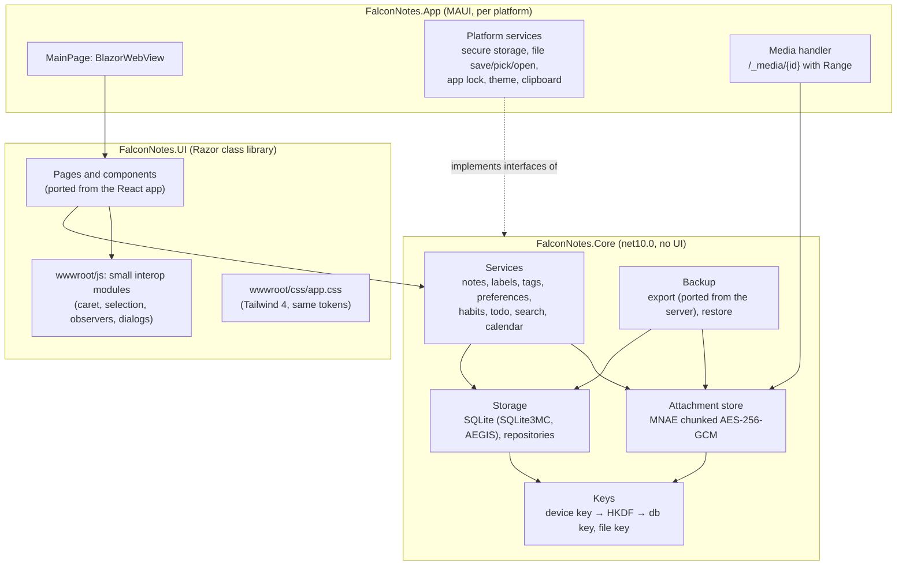

# 2. Architecture

## At a glance



Three projects, with dependencies pointing inwards only:

| Project | Target | Holds | May reference |
|---|---|---|---|
| `FalconNotes.Core` | `net10.0` | Domain records, every rule, storage, crypto, export and restore, background maintenance, the interfaces for platform features | BCL, `Microsoft.Data.Sqlite.Core`, `SQLite3MC.PCLRaw.bundle`, `Markdig`, `SkiaSharp` |
| `FalconNotes.UI` | `net10.0` Razor class library | Every page and component, layout, the JS interop modules, the stylesheet | Core, `Microsoft.AspNetCore.Components.Web` |
| `FalconNotes.App` | `net10.0-android`, `net10.0-windows10.0.19041.0`, `net10.0-maccatalyst` | `MauiProgram`, the `BlazorWebView` host, platform implementations of Core's interfaces, the media handler, icons, splash screen, packaging | Core, UI, MAUI, `CommunityToolkit.Maui` |

Core and UI never reference MAUI. Their tests therefore run on any desktop with `dotnet test` (see [11-testing.md](11-testing.md)).

## Repository layout

```text
FalconNotes.slnx
Directory.Build.props          nullable, warnings as errors, LangVersion latest, deterministic, doc comments required
Directory.Packages.props       central package management: every version pinned here
global.json                    .NET 10 SDK
CLAUDE.md                      instructions for AI agents
CHANGELOG.md                   Keep a Changelog
THIRD-PARTY-NOTICES.md         every shipped component's licence
LICENSE                        PolyForm Noncommercial 1.0.0
docs/                          this specification
fixtures/                      export-vectors.json, demo backups, the falcon mark, the web app's leaf
benchmarks/storage/            the storage benchmark (doc 13)
reference/maple-notes-1.8.0/   the web app, read-only (never built, never shipped, never edited)
src/
  FalconNotes.Core/
    Domain/          Note, NoteKind, Attachment, Label, LabelColor, Preferences, Profile, NoteState …
    Text/            TagParser, Titles, Todo, Habits, MarkdownEdit, TagSuggest, DateFormats, RelativeTime, Bytes, MenuOrder
    Markdown/        MarkdownRenderer (Markdig pipeline, tag links, task offsets, safe links)
    Storage/         Database (open, pragmas, migrations), Repositories, Sql
    Crypto/          KeyMaterial, AttachmentCipher, DecryptingAttachmentStream, ISecretStore
    Attachments/     AttachmentStore, AttachmentService, UploadPolicy, PhotoShrinker
    Notes/           NoteService, SearchService, CalendarService, TagService
    Labels/          LabelService
    Settings/        PreferencesService, ProfileService (not Preferences/: that name is the record's)
    Backup/Export/   NoteExporter, NoteFormatter, ExportNaming, ExportModels (ported from the server)
    Backup/Restore/  RestoreReader (port of parse.ts), RestoreRunner (port of importer.ts)
    Maintenance/     StartupTasks, TrashPurge, AttachmentCleanup, TempFiles, DatabaseBackups
    Platform/        IFileSaver, IFilePicker, IFileOpener, IClipboard, IAppLock, IThemeSource, IAppInfo
    Events/          ChangeFeed (NotesChanged, LabelsChanged, PreferencesChanged, ProfileChanged)
  FalconNotes.UI/
    Layout/          AppShell, Sidebar, Drawer, MainLayout
    Pages/           Home, Archive, Todo, Quick, Habits, Tags, Trash, Settings/*, Help, Welcome, Lock, KeyLost
    Components/      NoteCard, NoteList, Composer, FormatToolbar, TagSuggestions, Markdown, AttachmentGallery,
                     ImageViewer, TodoCard, HabitRow, HabitChart, HabitCalendar, Calendar, Labels, LabelPicker,
                     LabelSettings, MenuOrderEditor, PreferenceSections, ExportSection, RestorePanel, ui/* primitives
    State/           AppState (profile, preferences, lock state), Toasts, Dialogs
    Styles/app.css   Tailwind input: reference index.css, plus new rules only
    wwwroot/js/      interop modules
    wwwroot/css/     generated app.css (build output, not committed)
  FalconNotes.App/
    MauiProgram.cs, App.xaml(.cs), MainPage.xaml(.cs)
    wwwroot/index.html
    Platforms/Android|Windows|MacCatalyst/   platform services and manifests
    Services/        SecretStore, FileSaver, FilePicker, FileOpener, AppLock, ThemeSource, MediaHandler
    Resources/       AppIcon (falcon mark), Splash, Fonts (none: system fonts)
tests/
  FalconNotes.Core.Tests/     xUnit v3
  FalconNotes.UI.Tests/       xUnit v3 + bUnit
```

## Runtime model

### Blazor Hybrid specifics that shape the code

- **Components render on the UI thread.** In a `BlazorWebView`, component code runs on the MAUI dispatcher. Blocking
  calls freeze the app. `Microsoft.Data.Sqlite`'s `*Async` methods actually run synchronously, so **every repository
  method runs its SQL inside `Task.Run`**, and components only `await` services. File and crypto work does the same.
- **"Scoped" services live as long as the `BlazorWebView`**, which is the whole app. Register stateless services as
  singletons and per-view state as scoped. No service may hold a long-lived `SqliteConnection`: open one per unit
  of work, and let pooling (on by default) keep the key set.
- **Events replace TanStack Query.** The web app refetches through `invalidateQueries(["notes"])`. Here, every change
  goes through a service, which raises `ChangeFeed.NotesChanged` (or `LabelsChanged`, `PreferencesChanged`) after
  committing. Lists, counts and the calendar subscribe and reload their data. Components unsubscribe in `Dispose`.
  Reloads must keep scroll position: a list reloads the pages it has loaded so far, not just the first one.
- **Optimistic edits for structured notes** (todo lists, habits, ticked checkboxes) port `useNoteEditor`. The value
  shows at once and saves go one after another in a queue. On failure, a toast appears and the value reloads from
  the database.

### Start-up sequence

1. `MauiProgram` registers services and shows `MainPage`, whose background colour matches the theme (stone-100
   `#f5f5f4` or stone-950 `#0c0a09`), so there is no white flash.
2. `AppBootstrapper.StartAsync()`, before the first render (show the splash or a spinner meanwhile):
   1. Read the device key from `ISecretStore`. If there is none and **no database file exists**, create a key (32 bytes
      from `RandomNumberGenerator`) and store it. If there is none but a **database exists**, the key was lost: go to
      the **Key lost** screen ([07](07-screens.md#key-lost)) and touch nothing.
   2. Open the database. If the key does not open it (`SQLITE_NOTADB`), go to **Key lost** as well.
   3. If `PRAGMA user_version` is older than the app's schema, **copy the database file** to
      `backups/falcon-{utc:yyyyMMdd-HHmmss}-v{old}.db` first, keeping the newest 3, then run the migrations in one
      transaction each.
   4. Run maintenance, without blocking the first screen: purge trash older than 30 days, remove abandoned uploads
      (older than 24 h, `NoteId` null) and orphan files (older than 1 h), and delete `cache/open/` (decrypted temporary
      copies). Repeat the purges hourly while the app runs, as the server did.
   5. Load the profile and preferences into `AppState`, then apply the theme.
3. Route: no profile yet → **Welcome**; app lock on → **Lock**; otherwise **Home**.
4. Lock again after the app has been in the background for the chosen time ([03](03-data-storage-and-security.md#app-lock)).

### Routes

The same addresses as the web app, so links in the Help text and in notes work unchanged:

| Route | Page | Notes |
|---|---|---|
| `/` | Home | `?tag=`, `?q=`, `?day=yyyy-MM-dd`, `?label={id}` switch Home to a filtered list (see the reference `HomePage.tsx`) |
| `/archive`, `/todo`, `/quick`, `/habits`, `/tags`, `/help` | As named | |
| `/trash` | Trash | Reached from Settings → Backup & data |
| `/settings`, `/settings/{section}` | Settings | Sections: `account` (titled Profile), `appearance`, `menu`, `writing`, `features`, `labels`, `data`, `security` |
| `/welcome`, `/lock`, `/key-lost` | New screens | Not in the menu; the app shell is not shown on them |

Use Blazor's `Router` and `[SupplyParameterFromQuery]`. Navigation scrolls to the top, as `navigate()` did. On Android,
the system Back button goes back in the WebView's history and leaves the app only from Home (confirm the
`BlazorWebView` default in Phase 0).

## Data access

- `Microsoft.Data.Sqlite.Core` with `SQLite3MC.PCLRaw.bundle`. No EF Core and no ORM (D9).
- One `Database` class opens connections: the connection string from
  [03-data-storage-and-security.md](03-data-storage-and-security.md#database), then the pragmas `journal_mode=WAL`,
  `synchronous=NORMAL`, `foreign_keys=ON`, `secure_delete=ON`, `temp_store=MEMORY`.
- Repositories hold the SQL as constants, always use parameters, and map rows by hand. Run multi-statement changes
  in a transaction through `Database.InTransactionAsync(Func<SqliteConnection, SqliteTransaction, Task>)`.
- Migrations are numbered C# methods. `PRAGMA user_version` records the last one applied. Migration 1 creates the
  schema in [03](03-data-storage-and-security.md#schema).
- Keep queries index-only where the benchmark showed it matters. Lists, counts and filters must not read `NoteBodies`
  except for the notes they return.

## Serving attachments to the WebView

The page shows pictures and plays media from URLs, but the files are encrypted on disk. The app therefore answers
`https://0.0.0.1/_media/{attachmentId}?v={revision}` itself. The exact origin is the one the `BlazorWebView` uses on
each platform: build URLs relative to the page (`/_media/...`). The handler:

1. Looks up the attachment (it must exist), opens a `DecryptingAttachmentStream` (ported from the server; it is
   seekable), and answers `Range: bytes=a-b` with `206 Partial Content`, `Content-Range` and `Accept-Ranges: bytes`.
   Without a range header it answers `200` with the whole file. Video seeking needs ranges.
2. Sends `Content-Type` only for the passive inline types (`UploadPolicy.CanDisplayInline`), otherwise
   `application/octet-stream`. Always sends `X-Content-Type-Options: nosniff` and `Cache-Control: no-store`.
3. Reads nothing else from the request, and never serves a path outside the attachment store.

Mechanism, in order of preference. **Chosen: A** (spike S3, Android, 2026-10-01; WebView2 and WKWebView still to
verify). On Android the handler builds the native `WebResourceResponse` itself, because the WebView applies `Range`
by skipping into the whole file and takes the length from the stream's `available()`; `MediaInputStream` reports the
bytes left, seeks on `skip()`, and stops at the range's end ([10](10-implementation-plan.md#spike-results)).

The options considered:

| Option | How | Notes |
|---|---|---|
| A | `BlazorWebView.WebResourceRequested` (request interception added in .NET 10) | One implementation for all platforms, if it supports streamed bodies and `206` on each. **Verify.** |
| B | Platform interception: Android `WebViewClient.ShouldInterceptRequest`, WebView2 `WebResourceRequested` with a filter, WKWebView `WKURLSchemeHandler` on the app scheme | Known to work, three implementations. Android's `<video>` may bypass interception; test it. |
| C | A loopback HTTP listener on `127.0.0.1:{random port}` with a random 128-bit path token, started on demand | Works everywhere media stacks reach. Check that each WebView allows `http://127.0.0.1` from the app's origin. |
| Fallback | The page asks .NET for the bytes (`DotNetStreamReference`) and makes a `blob:` URL | What the web app does without its service worker. Acceptable for images. For videos over 50 MB, offer **Open** in the system player instead. |

Attachments are added from the UI through Core's `AttachmentService`:

- **Picker** (the paperclip): the native `IFilePicker` streams each file straight into the encrypted store, with
  progress. This is fast for large videos, because nothing crosses the WebView bridge.
- **Paste and drag-and-drop** (desktop): the page reads the `File` and streams it to .NET through `IJSStreamReference`.
- **Shrink photos** (preference on): `PhotoShrinker` (SkiaSharp) applies the reference rules before encryption: EXIF
  orientation, at most 2,560 px, JPEG 85%, skipped for GIF and SVG, kept only when at least a tenth smaller, original
  kept when the image has transparency or cannot be decoded ([04](04-domain-rules.md#attachments)).

## WebView hardening

The page is trusted code, but note text is user content and must never become markup or script, nor reach the network.

- `index.html` sets `Content-Security-Policy: default-src 'self'; script-src 'self'; style-src 'self' 'unsafe-inline';
  img-src 'self' blob: data:; media-src 'self' blob:; connect-src 'self'; object-src 'none'; frame-src 'none';
  base-uri 'self'; form-action 'none'`. Add only what Blazor Hybrid itself needs on a platform, and record why.
  `base-uri` is `'self'`, not `'none'`, because Blazor needs `<base href="/">` (spike S5).
- Markdown is rendered with raw HTML disabled, and link URLs pass the same safe-protocol check as react-markdown
  ([04](04-domain-rules.md#markdown-rendering)). Remote images in notes are blocked by the policy above.
- Navigation away from the app's origin is cancelled (`UrlLoading`). Links to `http(s):` and `mailto:` open in the
  system browser or mail app through `Launcher`; any other scheme is ignored.
- No `eval`, no inline scripts, no third-party JavaScript. JS interop modules are plain ES modules in
  `FalconNotes.UI/wwwroot/js/`.

## JavaScript interop

Keep JavaScript small and limited to what the DOM must do. Rules and text manipulation stay in C#. One module per
concern:

| Module | Does | Ported from |
|---|---|---|
| `appearance.js` | Sets `dark`/`light` classes, `data-accent`, `color-scheme`; remembers them in `localStorage` for the next start | `lib/appearance.ts` |
| `editor.js` | Autosize a textarea (max 480 px), focus at end, read the selection, apply an `Edit` with `execCommand('insertText')` so Undo works (fall back to setting the value), caret coordinates for the tag popup | `lib/focus.ts`, `lib/caret.ts`, `components/FormatToolbar.tsx`, `components/Composer.tsx` |
| `files.js` | Paste and drop of files: stream each `File` to .NET | `components/Composer.tsx` |
| `observe.js` | `nearViewport(element, margin, dotnet)`: fires once when an element comes within 600 or 800 px; the infinite-scroll sentinel | `lib/viewport.ts`, `components/NoteList.tsx` |
| `markdown.js` | Event delegation on a rendered note: task checkbox clicks call .NET with `data-task`; internal links navigate; external links go to .NET to open | `components/Markdown.tsx` |
| `gestures.js` | Double-tap and double-click to edit, swipe in the image viewer, pointer drag in the menu-order editor | `lib/doubleTap.ts`, `components/ImageViewer.tsx`, `components/MenuOrderEditor.tsx` |
| `dialogs.js` | `<dialog>`: `showModal`, `close`, Esc and focus return; dropdown menu placement, outside click and arrow keys | Radix Dialog and DropdownMenu in the reference |

## Platform services

Core defines the interfaces; the App implements them per platform; tests use fakes.

| Interface | Android | Windows | macOS (Catalyst) |
|---|---|---|---|
| `ISecretStore` (the device key) | `SecureStorage` (Keystore-backed) | `SecureStorage` (needs a **packaged** app) | `SecureStorage` (Keychain; needs the keychain entitlement) |
| `IFilePicker` | `FilePicker.PickMultipleAsync` | same | same |
| `IFileSaver` (export, Save a copy) | `AndroidFileSaver`: `ACTION_CREATE_DOCUMENT`, then a .NET `FileStream` on the document's descriptor (the toolkit's saver took 13 minutes for 1 GB; spike S4) | `CommunityToolkit.Maui.Storage.FileSaver` | same |
| `IFileOpener` (Open with the default app) | `Launcher.OpenAsync(new OpenFileRequest)` from `cache/open/` | same | same |
| `IClipboard` (Copy text) | `Clipboard.SetTextAsync` | same | same |
| `IAppLock` (biometrics) | AndroidX `BiometricPrompt` | `UserConsentVerifier` (Windows Hello) | `LAContext` (Touch ID) |
| `IThemeSource` (device theme and changes) | `Application.RequestedTheme` + `RequestedThemeChanged` | same | same |
| `IAppInfo` (version) | `AppInfo.VersionString` | same | same |
| `IAppDirectories` (data and cache folders) | `FileSystem.AppDataDirectory`, `FileSystem.CacheDirectory` | same | same |

See [12-platforms.md](12-platforms.md) for the platform details.

## Dependencies

Only these, unless a decision is recorded here first. Every one must be on the allowed list in
`reference/maple-notes-1.8.0/docs/licensing.md` (MIT, Apache-2.0, BSD, ISC, …) and be listed in
`THIRD-PARTY-NOTICES.md`.

| Package | Licence | Use |
|---|---|---|
| .NET MAUI, Blazor (`Microsoft.AspNetCore.Components.WebView.Maui`) | MIT | App framework |
| `Microsoft.Data.Sqlite.Core` | MIT | Data access |
| `SQLite3MC.PCLRaw.bundle` 2.4.x | MIT (bundles SQLite, public domain, and permissive embedded code: see the reference `licensing.md`) | Encrypted SQLite, native for android-arm/arm64/x86/x64, maccatalyst-arm64/x64, win-x86/x64/arm64 |
| `Markdig` | BSD-2-Clause | Markdown rendering |
| `SkiaSharp` (+ native assets per platform) | MIT | Shrinking photos |
| `CommunityToolkit.Maui` | MIT | File saver, status bar colour |
| Tailwind CSS 4 standalone CLI | MIT | Build-time only, generates `app.css` |
| Lucide icons (SVG paths, copied into `Icon.razor`) | ISC | Icons |
| Tests: `xunit.v3`, `bunit` | Apache-2.0, MIT | Tests only |

Not allowed: anything in the reference's "Not allowed" list, and the "known traps" there (FluentAssertions 8+,
MediatR 13+, AutoMapper 15+, ImageSharp, commercial SQLCipher builds).

## Styling pipeline

- `FalconNotes.UI/Styles/app.css` starts as a copy of `reference/maple-notes-1.8.0/src/maple-web/src/index.css`: the
  same `@theme` tokens, accent overrides, `dark` variant, `.markdown` rules and `.note-card`. Add new rules at the end,
  in the same style.
- An MSBuild target runs the Tailwind 4 standalone CLI before build:
  `tailwindcss -i Styles/app.css -o wwwroot/css/app.css --minify`, with `@source` pointing at `**/*.razor`. Pin the CLI
  version and download it, checking its SHA-256, in a restore step. Do not commit the output.
- Tailwind only sees complete class names. Write classes out in full, as `lib/labels.ts` does; never build them from
  pieces.

## Logging and diagnostics

- `Microsoft.Extensions.Logging` to the debug output only. No telemetry, no crash reporting service, no network.
- Never log note text, titles, tags, label names, file names or keys. Log IDs and counts.
